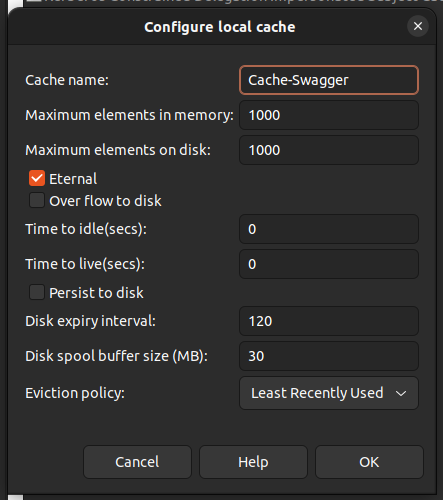

# Open API Validator

This library was created to complement the latest version of Axway API Gateway. This library is inspired by [openapi-validator](https://github.com/Axway-API-Management-Plus/openapi-validator).

# Build

To create the jar, please run the following command with maven

```shell
mvn clean install
```

or with gradle

```shell
gradle clean build
```

# Installation

To install, put the jar under ext/lib. After that, restart the API Gateway. It is recommended to make the jars files known in the Policy Studio as well as it is describe here: https://docs.axway.com/bundle/axway-open-docs/page/docs/apim_policydev/apigw_poldev/general_ps_settings/index.html#runtime-dependencies

# Setup Cache

This library uses the cache from the axway api gateway's built-in ehcache to store the swagger configuration. Please create 1 cache via policy studio with the following configuration.



# Example Code

To call the OpenAPI validator, use a scripting filter. You can use Groovy or any other supported language here. You can use it to validate requests and responses.

```groovy
import com.axway.library.OpenAPIValidator
import com.vordel.trace.Trace

def invoke(msg) {
    // Get the ID of the API currently processed
    def apiId = msg.get("api.id")
    def validator = OpenAPIValidator.getInstance(apiId, "apiadmin", "changeme", "https://localhost:8075", "v1.4")

    // Get required parameters for the validation
    def payload = bodyAsString(msg.get('content.body'))
    def path = msg.get("http.request.path")
    def verb = msg.get("http.request.verb")
    def queryParams = msg.get("params.query")
    def headers = msg.get("http.headers")
    def contentHeaders = msg.get("http.content.headers")

    try {
        // Content-Headers contains the required Content-Type header - Merge them into the headers attribute
        headers.addHeaders(contentHeaders)
        // Call the validator itself
        def rc = validator.isValidRequest(payload, verb, path, queryParams, headers)
        Trace.info('rc: ' + rc)

        def validationReport = validator.validateRequest(payload, verb, path, queryParams, headers)
        if (validationReport.getIsErrorRequired()) {
            for (def message : validationReport.getMessageValidationRequired()) {
                Trace.info('message required : ' + message.getMessage())
                Trace.info('key: ' + message.getKey())
            }
        }

        if (validationReport.getIsErrorFormat()) {
            for (def message : validationReport.getMessageValidationFormatError()) {
                Trace.info('message format data error: ' + message.getMessage())
                Trace.info('key: ' + message.getKey())
            }
        }
        return rc
    } catch (Exception e) {
        Trace.error('Error validating request', e)
        return false
    }
}

def bodyAsString(body) {
    if (body == null) {
        return null
    }
    try {
        return body.getInputStream(0).text
    } catch (IOException e) {
        Trace.error('Error while converting ' + body.getClass().getCanonicalName() + ' to java.lang.String.', e)
        return null
    }
}
```

# API Management Version Compatibility

This artefact has been tested with API-Management Versions

| Version      | Comment         |
|:-------------| :---            |
| 7.7-20230830 |                 |